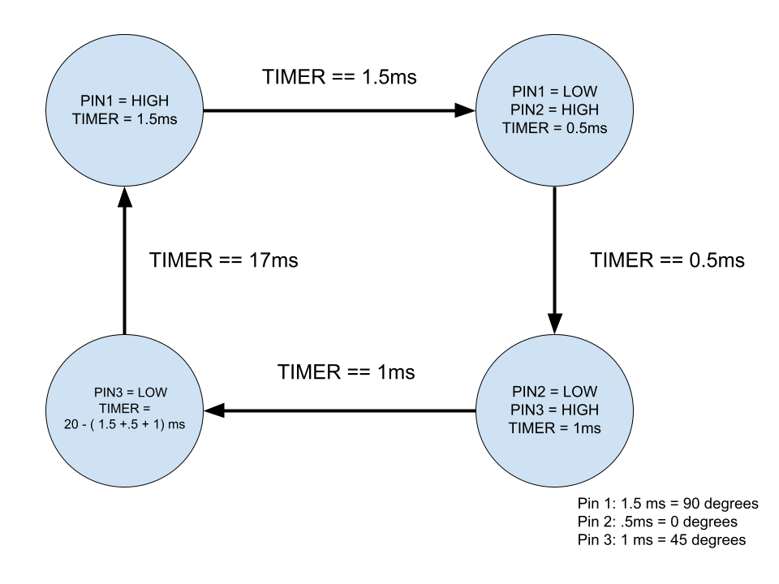

## Preface
This library is created for basic control over a hobbyist continous or standar servos in the C language, tested up to 4 servos at the sime time. The library slightly extends to having a few functions to switch pin modes and set a pin high or low. These functions are very similar to the Arduino Library functions.

## Examples
Here is a basic example on how to control a singular servo

```c
servo_init(); // Initialize the 
servo_attach(pin_number);

servo_write(pin_number, angle); 
```
For more than one servo it is not any different
```c
servo_init();
servo_attach(pin_number);
serv_attach(pin_number_2);

servo_write(pin_number, angle); 
servo_write(pin_number, speed);
```
Continous and Standard servos can be used with this library
### Important Notes
- `servo_init()` must be called before attaching or writing to any pins
- `servo_attach()` will automatically set the angle/speed to 90
- Timer/Counter 1 is used with this library, it is currently not possible to change the timer at this current moment
- This implementation uses Interrupts and clearing interrupts will disturb the functionality
## Reference Table
### Servo.h Functions
| Function | Brief Description |
|---|---|
| servo_init() | Turn on hardware timers and options|
| servo_attach(uint8_t pin) | Set pin to send servo control pulse |
| servo_write(uint8_t pin, uint8_t val) | Sends control signal to servo on pin |
### Basic_wiring.h Functions
These are basic wiring functions that are implemented almost exactly like the Arduino Library, it is currently very limited
| Function | Brief Description |
|---|---|
| set_pin_output(uint8_t pin) | Sets pin to output|
| write_pin (uint8_t pin, uint8_t val) | Writes HIGH or LOW to pin|

## Demo
The code used in the  [YouTube Demo](https://www.youtube.com/watch?v=L5e-ptMNdWE)
```c
#include "servo.h"
#include "basic_wiring.h"
#include <util/delay.h>


int main(void) {
    servo_init();
    servo_attach(12);
    servo_attach(10);
    servo_attach(11);
    servo_attach(8);
    while (1) {

        // Move the servo to the minimum position
        servo_write(10,0);
        servo_write(12,0);
        servo_write(11,0);
        servo_write(8,0);
        _delay_ms(3000);
        servo_write(10, 180);
        servo_write(8,180);
        servo_write(11, 180);
        servo_write(12, 90);
        _delay_ms(3000);
    }
}

```

## Implementation Details

### PWM Servo Control
The Servos use PWM to control the position. Each pulse has a duty cycle of 2.5% to 12.5% at 50Hz. Due to having a maximum of 12.5% duty cycle, it is possible to overlap multiple different signals on one timer, having a maximum of 8. 



In this implementaion the timer is in CTC mode (Clear Timer on Compare) and is used to bit bang a pwm signal on whichever pin is selected. 
- First it will turn on the first pin attached and change the timer to interrupt when the pin needs to be turned off. 
- When the ISR is entered to turn off the pin, the next pin attached will start and change the timer until it needs to be turned off. This process is repeated until the last servo attached is turned off. 
- On the falling edge of the last servo, the timer is cleared and changed to wait the difference between the time it took to bit bang the signals and 20ms. This is done to make sure that the first signal gets it's 20ms period. 
- Afterwards it cycles back to the first step.

### Basic Wiring
The basic wiring functions mainly came from the Arduino-core library on github. These functions implementations are done by having a look up array stored in program/flash memory that corresponds to their respective pin and port addresses. These look up tables are used in functions like `write_pin()` to correspond Arduino pins to their respective pins and ports on the ATMEGA microcontroller.
```c
#define port_mode_register(PIN) ( (volatile uint8_t *) pgm_read_byte( port_to_mode_PGM + (PIN) ))
#define port_mode_output(PIN) ( (volatile uint8_t *) pgm_read_byte( port_to_output_PGM + (PIN) ))
#define pin_to_port(PIN) ( pgm_read_byte( pin_to_port_PGM + (PIN) ))
#define pin_to_bitmask(PIN) ( pgm_read_byte( pin_to_bit_mask_PGM + (PIN) ))

const uint16_t PROGMEM pin_to_bit_mask_PGM[] = {
        _BV(0), //PD
        _BV(1),
        _BV(2),
        _BV(3),
        _BV(4),
        _BV(5),
        _BV(6),
        _BV(7),
        _BV(0), // PB index 8
        _BV(1),
        _BV(2),
        _BV(3),
        _BV(4),
        _BV(5)
};

const uint8_t PROGMEM pin_to_port_PGM[] = {
        PD,//PD is defined as 4
        PD,
        PD,
        PD,
        PD,
        PD,
        PD,
        PD,
        PB,//PB is defined as 2
        PB,
        PB,
        PB,
        PB,
        PB
};

const uint16_t PROGMEM port_to_mode_PGM[] = {
        NOT_A_PORT,
        NOT_A_PORT,
        (uint16_t) &DDRB,
        (uint16_t) &DDRC,
        (uint16_t) &DDRD,
};
const uint16_t PROGMEM port_to_output_PGM[] = {
        NOT_A_PORT,
        NOT_A_PORT,
        (uint16_t) &PORTB,
        (uint16_t) &PORTC,
        (uint16_t) &PORTD,
};
```


